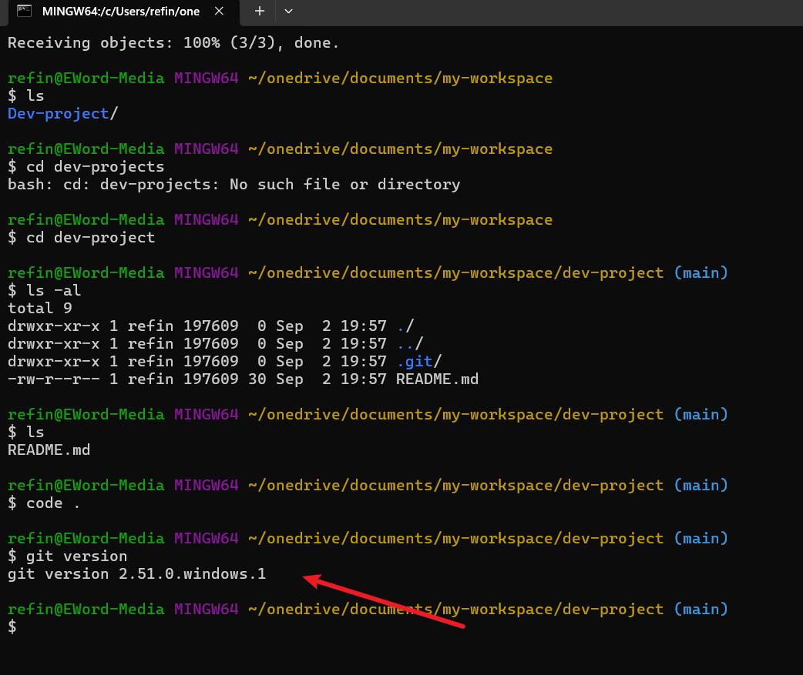
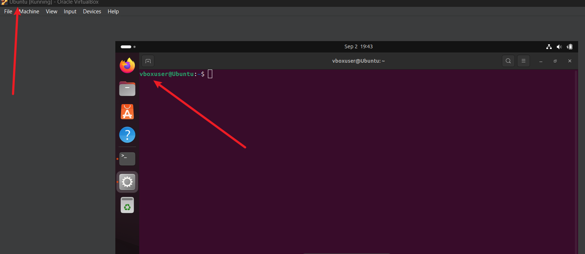

# Dev-project
## DevOps Environment Setup Guide

This guide provides step-by-step instructions to set up a DevOps environment with essential tools such as Git, Visual Studio Code, VirtualBox, Ubuntu, and GitHub.

## Prerequisites

- Internet Connection – Required for downloading tools and accessing online resources.

- Computer Requirements – Minimum 8GB RAM (64-bit recommended) for running virtual machines.

# Required Installations

# 1. Install Visual Studio Code
VS Code is a lightweight but powerful code editor.

## Installation Steps:

- Download from [VS Code Official Site.](https://code.visualstudio.com/)
- Install using the setup wizard.
- Open VS Code and check installation.
---

# 2. Git
Git is a version control system for tracking changes in code.

Download: [Git for Windows](https://git-scm.com/downloads/win)

## Installation Steps:

i. Download and run the `.exe` installer.

ii. Select default options for command-line integration and OpenSSL security.

iii. Click "Finish" to complete the installation.

---
---

# 2.1. Install Git

## Installation Commands:

>`sudo apt update`

>`sudo apt install git -y`

## Verify Installation:

`git --version`

## Basic Git Setup:

>git config --global username "Your Name"

>git config --global user email <your-email@example.com>

>git init

>git add .

>git commit -m "Initial commit"

# 3. VirtualBox (For Running Ubuntu)

VirtualBox allows you to run virtual machines like Ubuntu.

Download: [Oracle VirtualBox](https://www.virtualbox.org/)

## Installation Steps:

- i. Download the Windows host version.

- ii. Run the `.exe` installer and follow the wizard.

- iii. Click "Finish" after installation.

## Installation Commands:

>`sudo apt update`

>`sudo apt install virtualbox -y`

--- 
# 4. Ubuntu on VirtualBox (Linux Environment Setup)

Download Ubuntu ISO: [Ubuntu Official Site](https://ubuntu.com/download/desktop)

## Steps to Install Ubuntu on VirtualBox:

- Open VirtualBox and create a new virtual machine (Linux → Ubuntu).

- Allocate at least 2GB RAM and create a Virtual Hard Disk.

- Select the downloaded Ubuntu .iso file.

- Start the Virtual Machine and follow the Ubuntu installation process.

## Create and Run Ubuntu VM:

>`vagrant init ubuntu/bionic64`
>`vagrant up`

# Required Account Setups
- GitHub Account: 
Sign Up on [GitHub](https://github.com/), Create a repository and push a sample project.

- AWS Account: [AWS Free Tier](https://aws.amazon.com/free/)  (Requires a credit card with at least $1 balance). Set up an EC2 instance for cloud deployment.

# Conclusion
This guide provides essential DevOps setup instructions with proper commands and screenshots.